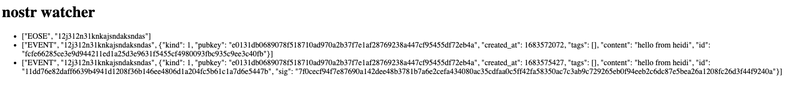

# nostr-javascript

This is a project to build a PoC on Nostr Protocal with javascript

## Phase 1

- What are some of the challenges you faced while working on Phase 1?

1. I was struggling to write it in Java, I have tried two days to understand how to set up websocket connection in Java but everytime when I send message it terminate the session.
2. In the end, I have decide to submit the code in Javascript as it have a well-developed library in npm
3. As I am new to websocket connection. I am quite lots in the beginning but in the end I have summerize the step I need to do. create websocket connection > serialized event > send event
4. In Javascript I dont need to write up the serialization detail but but I was looking that into Java I learnt a lot on SHA256 hashing.

- What kind of failures do you expect to a project such as DISTRISE to encounter?

1. How would the event aggregator behave when there are massive message coming in and how that pass message to User's own relay.
2. Single failure point on Event aggregator. If it goes down, then means all of the even will get lost?
3. If any of the relay stop updating, shall we inform user?
4. if user relay goes down, means we dont end the connection safely, how will nostr server behave?
